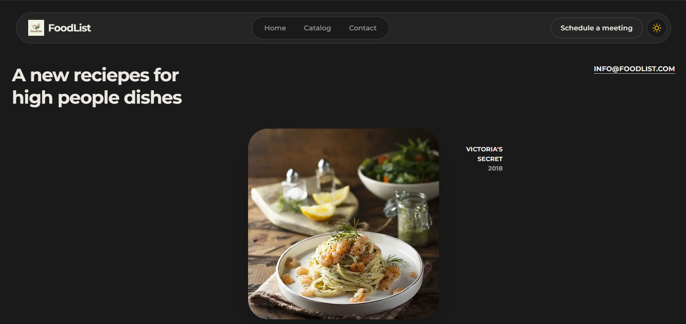

# Foodlist — A Clean, Focused Food Management App

[](https://github.com/Himdeunn/foodlist/stargazers) [](https://github.com/Himdeunn) [](https://github.com/Himdeunn)

> *Disclaimer: This project still updating, whenever someone can clone or contribution this repository, make sure following guide at below*

Foodlist is a modern web app built to help you organize, manage, and explore food items with ease. It's a project that blends clean interface design with solid frontend architecture — the goal being a simple, intuitive experience for anyone working with food data.


### **Live Demo:** [View Live Site Here](https://https://neo-blog.himdeunn.my.id/)

---

## 🌟 Features

- **Dynamic Catalog Management:** Add, edit, and delete food entries with proper data validation.
- **Search & Filter:** Quickly find items by category, flavor, or main ingredient.
- **Responsive Layout:** Works well across all screen sizes, from mobile to widescreen desktop.
- **Food Data Visualization:** Nutritional info and descriptions are presented through clean, readable UI components.
- **Smooth State Handling:** User input and the interface stay in sync without any friction.

---

## 🛠️ Tech Stack

The technologies used here were chosen with rendering speed and maintainability in mind.

| Technology | Role | Why |
|---|---|---|
| HTML5 | Semantic Structure | Better accessibility and SEO out of the box. |
| CSS3 / SCSS | Styling & Layout | Makes responsive design and smooth transitions straightforward. |
| JavaScript | App Logic | Handles all user interactions and DOM manipulation. |
| GitHub Pages | Deployment | Fast hosting that fits naturally into a Git-based workflow. |

---

## 🚀 Getting Started

### Prerequisites

- A modern web browser (Chrome, Firefox, Edge, or Safari).
- Git installed on your machine *(optional, only needed to clone the repo)*.

### Setup

1. **Clone the repository:**
   ```bash
   git clone https://github.com/Himdeunn/foodlist.git
   ```

2. **Navigate into the project folder:**
   ```bash
   cd foodlist
   ```

3. **Run the app:**
   Open `index.html` directly in your browser, or use the **Live Server** extension in VS Code for a better development experience with live reloading.

---

## 🎨 Design Philosophy

This project was built with UI/UX principles in mind from the start:

- **Proximity:** Related elements are grouped together to reduce cognitive load.
- **Visual Hierarchy:** Typography and color contrast guide the user's eye to what matters most.
- **Minimalism:** Unnecessary visual noise is stripped away so the focus stays on the content.

---

## 🤝 Contributing

Contributions are welcome! If you'd like to improve something — whether it's a feature or a design tweak — here's how:

1. Fork the project.
2. Create a new feature branch (`git checkout -b feature/YourFeature`).
3. Commit your changes (`git commit -m 'Add YourFeature'`).
4. Push the branch (`git push origin feature/YourFeature`).
5. Open a Pull Request.

---

## 📄 License

This project is licensed under the **MIT License**. See the `LICENSE` file for more details.